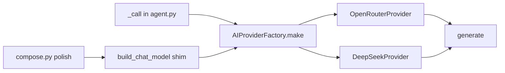

# AI provider factory

The chatbot is Python (`onspotchatbotmulti`), so the PHP sketch maps to an abstract class plus a factory, not PHP classes. Booking, session, tools, prompts, and the understand → tools → respond flow stay as they are. Only the HTTP call that talks to the model moves behind `generate()`.

Today every chat completion goes through [`build_chat_model`](onspotchatbotmulti/app/services/llm.py), which builds one LangChain `ChatOpenAI` for `fireworks`, `openai`, and `groq`. [`_call`](onspotchatbotmulti/app/graph/nodes/agent.py) in the llm-first agent is the only place that sends the system prompt and the user turn. Legacy polish in [`compose.py`](onspotchatbotmulti/app/graph/nodes/compose.py) also calls `build_chat_model`. Current `.env` is `LLM_PROVIDER=fireworks` with a Fireworks-hosted DeepSeek model.

## Classes

New package `onspotchatbotmulti/app/services/ai/`:

- `base.py` — `AIProvider` with `generate(system, user, *, json_mode, max_tokens, reasoning) -> str`. Same inputs `_call` already passes. Empty text and `<think>` stripping stay in `_call`, not in the provider, so retries and the "assistant unavailable" path do not change.
- `openrouter.py` — `OpenRouterProvider`. Same OpenAI-compatible client the bot uses today (LangChain `ChatOpenAI`). Two profiles inside this one class, not shared defaults:
  - `fireworks` — current Fireworks URL, Fireworks model, `FIREWORKS_API_KEY`. Today's `.env` stays on this profile.
  - `openrouter` — `https://openrouter.ai/api/v1` and `OPENROUTER_API_KEY`. A Fireworks model id (`accounts/fireworks/...`) is not sent to OpenRouter. If `LLM_MODEL` is still that id, the class uses its own OpenRouter default instead.
- `deepseek.py` — `DeepSeekProvider`. Direct DeepSeek API (`https://api.deepseek.com`) and `DEEPSEEK_API_KEY`. This is not the DeepSeek model hosted on Fireworks. A Fireworks model id is ignored here too; the class uses its own default model unless `LLM_MODEL` is a DeepSeek model name.
- `factory.py` — `AIProviderFactory.make(name=None)`. `name` defaults to `settings.llm_provider`. A new client is built on every `make()` — no cached client, so a provider switch cannot keep the previous key or URL. Unknown name raises the same kind of error `build_chat_model` raises today. `none` / empty returns no provider, same as now.

`reasoning_effort` and `response_format` are applied inside `generate()`, not in the agent. Fireworks/OpenRouter can send `reasoning_effort`. DeepSeek only sends it if that API accepts it; otherwise the class omits it so a 400 does not take the bot down.

`generate()` and the compose shim must use the same client builder on the provider. Agent and legacy polish cannot disagree on URL, model, or key.

A later `OpenAIProvider` or `GeminiProvider` is a new subclass plus one factory branch. No agent changes.

## What stays the same

- [`_call`](onspotchatbotmulti/app/graph/nodes/agent.py) still retries, strips think tags, and raises `LLMUnavailable`. It asks the factory for a provider and calls `generate()` instead of building the model itself. Prompts, history text, tool gate, and fact guard are untouched.
- [`build_chat_model`](onspotchatbotmulti/app/services/llm.py) remains the function compose and its tests import. It becomes a thin shim: `make()` then the provider's existing LangChain model, so [`compose.py`](onspotchatbotmulti/app/graph/nodes/compose.py) and the monkeypatches in `test_api_truth_architecture.py` / `regression/test_security_and_sessions.py` do not need a new call style.
- `openai`, `groq`, and `anthropic` stay reachable from the factory (same behavior as today's `build_chat_model`) so an old env value does not crash. They are not new product classes in this change.

## Config

Existing fields stay: `LLM_PROVIDER`, `LLM_MODEL`, `LLM_BASE_URL`, `LLM_API_KEY`, `FIREWORKS_API_KEY`.

Add optional overrides, used only when `LLM_API_KEY` is empty for that provider:

- `OPENROUTER_API_KEY`
- `DEEPSEEK_API_KEY`

Switch with `LLM_PROVIDER=openrouter` or `LLM_PROVIDER=deepseek`. `LLM_BASE_URL`, when set, still overrides the class URL. `LLM_MODEL` overrides the class model only when it is valid for that provider. A Fireworks model id does not follow the user onto DeepSeek or OpenRouter.

## Tests

Normal `pytest` does not call OpenRouter or DeepSeek. No key, no network, no change to the existing suite.

Unit tests, always run:

- Factory returns `OpenRouterProvider` for `openrouter` and `fireworks`, `DeepSeekProvider` for `deepseek`, and `None` for `none`.
- Fireworks model id is not copied onto the DeepSeek or OpenRouter client.
- `_call` still retries and strips `<think>` around a fake `generate()`.
- `build_chat_model` still returns a model object for compose when a provider is configured.

Live option, off by default. Pick the provider when you want a real call:

- `pytest tests/test_ai_provider_live.py --llm-provider openrouter`
- `pytest tests/test_ai_provider_live.py --llm-provider deepseek`

That test is skipped unless `--llm-provider` is one of those two and the matching key is in the environment (`OPENROUTER_API_KEY` or `DEEPSEEK_API_KEY`, or `LLM_API_KEY`). It sends one short `generate()` and checks a non-empty reply. It does not run the booking graph, so memory, tools, and prompts are not part of the live call.

## Review notes

These were the real risks in the first draft. They are now part of the design above.

- One shared "pass LLM_MODEL through" rule would send `accounts/fireworks/models/...` to DeepSeek and OpenRouter and the call would fail. Each class keeps its own default.
- A cached provider would keep the old key after an env change. `make()` builds a new client every time.
- Putting `reasoning_effort` in the agent would 400 on an API that does not support it. The provider owns that parameter.
- Turning the whole existing suite into live provider tests would spend credits and fail in CI without keys. Live coverage is one optional test with an explicit provider flag.
